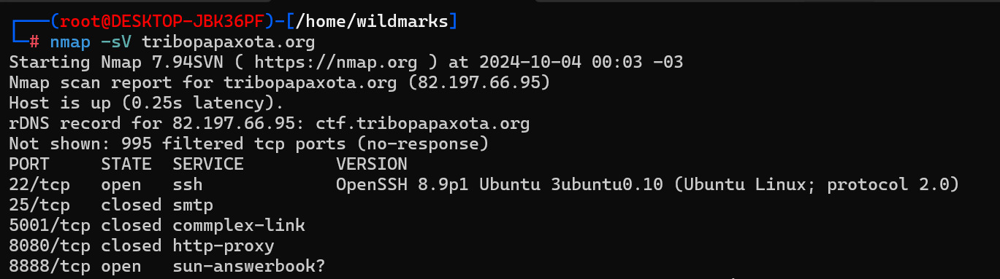
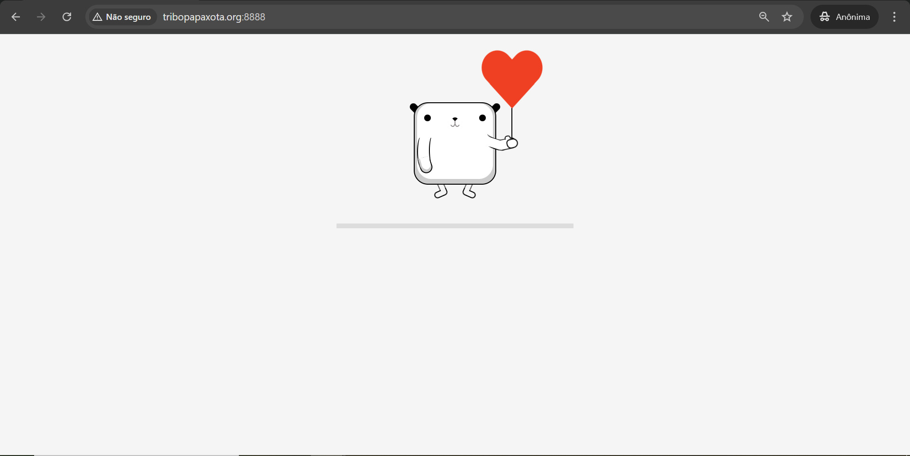
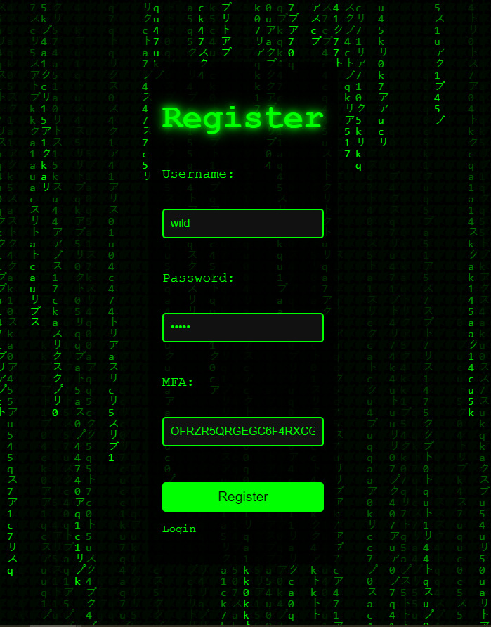
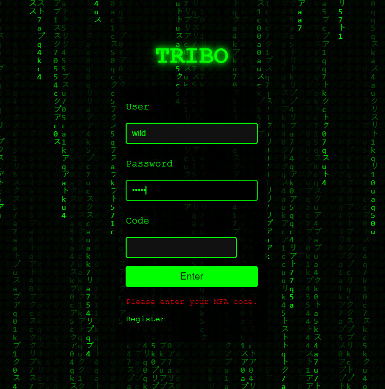

# CTF Pato Academy - Setembro 2024

Este é o relato da minha experiência com o CTF da Pato Academy. O objetivo deste CTF era encontrar o máximo de falhas possíveis e documentar, não há flags.

## Domínios e Subdomínios

Nos foi dado os seguintes domínios e subdomínios:

- `http://tribopapaxota.org`
- `http://ctf.tribopapaxota.org`
- `http://git.tribopapaxota.org`
- `http://hub.tribopapaxota.org`

*(Nome escolhido carinhosamente pelos moderadores xD)*

Tentei acessá-los, mas não carregaram:

Resolvi fazer um scan com o nmap para ver as portas que estavam abertas:

A porta `8888` estava aberta, rodando uma aplicação web nela. Tentei acessar redirecionando para essa porta:

Consegui acessar, porém a página principal não continha nada além de uma animação. O próximo passo foi fazer um scan de diretórios. Eu costumo usar a ferramenta `dirsearch`.

Acessei o diretório `/register` e fiz um cadastro. Notei um campo chamado **MFA** com um código. **MFA** é a sigla de "Multi-Factor Authentication", então anotei o código para usar posteriormente no login.

## Tentando Fazer Login

Fui até o diretório `/login`, inseri meu login e senha, porém havia um campo **CODE**, onde provavelmente seria usado o código da página de registro. No entanto, não funcionou. Eu já havia feito um outro CTF da comunidade onde precisei gerar 2FA a partir de um código OTP, então usei um script em Python que eu já tinha no Kali para gerar o código:

Consegui logar. A partir daí, tentei várias superfícies de ataque, a maioria sem sucesso, porém consegui identificar duas falhas interessantes.

## Primeira Exploração - Token de Sessão

O token de sessão era um base64 que, ao ser decodificado, era composto por:

